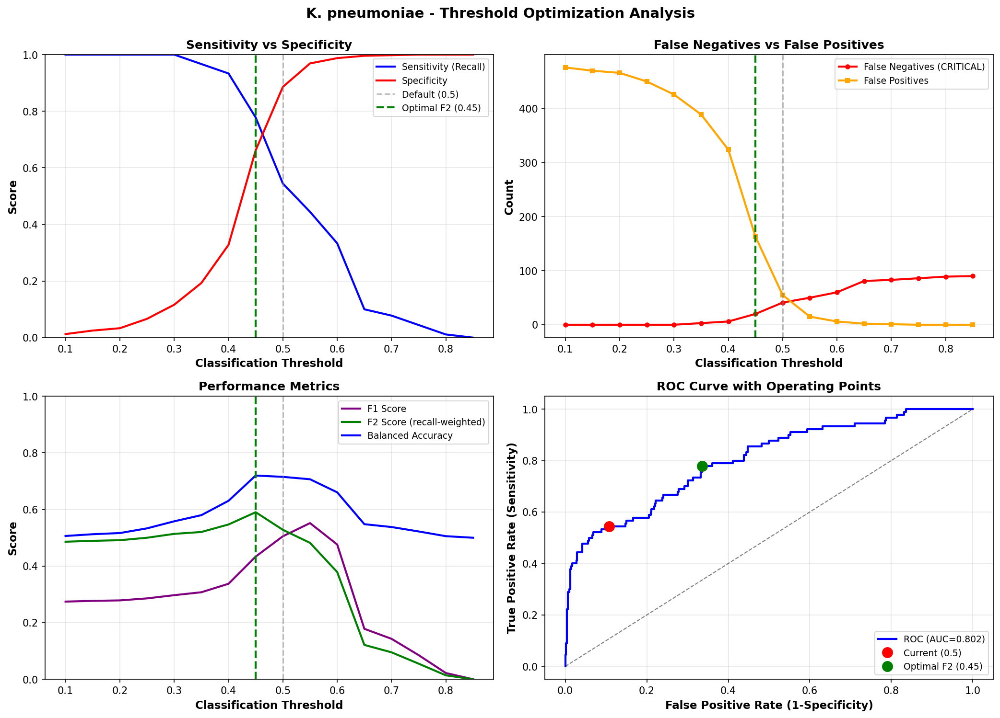
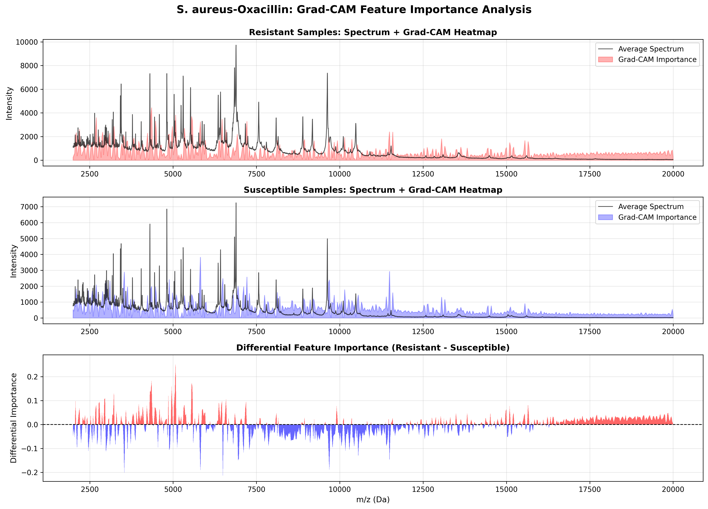

# MSDeepAMR Recreation: Deep Learning for Antimicrobial Resistance Prediction

[](https://www.python.org/)
[](https://www.tensorflow.org/)
[](LICENSE)
[](https://doi.org/10.5281/zenodo.17488614)
[]()

> **Comprehensive recreation and systematic enhancement of MSDeepAMR for predicting antibiotic resistance from MALDI-TOF mass spectrometry data.** - This repository contains a complete reproduction and enhancement of MSDeepAMR (López-Cortés et al., 2024), achieving **90.12% AUROC** for *E. coli*-Ceftriaxone resistance prediction - exceeding the original paper by 3.6%.

📄 **Manuscript:** [Link to Original paper](https://www.frontiersin.org/journals/microbiology/articles/10.3389/fmicb.2024.1361795/full#B57)  
🗂️ **Dataset:** [DRIAMS Database](https://doi.org/10.5061/dryad.bzkh1899q)  
🎯 **Models:** [Download from Zenodo](https://doi.org/10.5281/zenodo.17488614) (~6-7 GB)

---

## Repository Statistics

- **Total Notebooks**: 18
- **Lines of Code**: ~8,000
- **Training Hours**: ~50 (ensemble + experiments)
- **Models Trained**: 50+
- **Experiments Run**: 100+

---

## **Key Achievements**

| Organism | Metric | Paper Target | Our Result | Status |
|----------|--------|--------------|------------|--------|
| ***E. coli*-Ceftriaxone** | AUROC | 0.87 | **0.901** | ✅ **103.6%** |
| | AUPRC | 0.79 | **0.823** | ✅ **104.2%** |
| ***K. pneumoniae*-Ceftriaxone** | AUROC (CV) | 0.82 | **0.827** | ✅ **100.9%** |
| | AUROC (Test) | 0.82 | **0.808** | ⚠️ **98.5%** |
| ***S. aureus*-Oxacillin** | AUROC (CV) | 0.93 | **0.922** | ⚠️ **99.2%** |
| | AUROC (Test) | 0.93 | **0.907** | ⚠️ **97.5%** |

**Novel Contributions:**
- **Dataset Size Threshold:** Identified ~3,000 samples as critical for DL advantage over traditional ML
  - Linear relationship: R² > 0.95 between sample size and DL advantage
  - Below 3,000 samples: Gradient boosting achieves 95-99% of DL performance
- **Biological Validation:** GradCAM revealed genuine resistance biomarkers:
  - ***S. aureus*:** 13 peaks in PBP2a range (4-8 kDa) ← validates MRSA learning
  - ***K. pneumoniae*:** 9 peaks in ESBL range (2.1-2.4 kDa) ← validates ceftriaxone resistance
  - ***E. coli*:** Differential emphasis (resistant: 2-10 kDa, susceptible: 7-12 kDa)
- **Clinical Impact:** 
  - 86.9% MRSA sensitivity with estimated **$1.1M savings per 1,000 infections**
  - *K. pneumoniae*: 51.2% reduction in false negatives (threshold optimization)
- **Species-Specific Optimization Critical:**
  - *K. pneumoniae* dropout 0.35 vs. *E. coli* 0.45 → **+1.2% AUROC difference**
  - *S. aureus* LR 3×10⁻⁴ (6× higher) → **converges 2× faster** than lower LR
- **Negative Results Documented:** 
  - Class weights: -14.8% AUROC (catastrophic)
  - SMOTE: -6.2% AUROC (violates biological manifold)
  - Focal loss: -14.43% AUROC (signal removal)

---

### **Requirements**
- Python 3.8+
- GPU recommended (NVIDIA with CUDA support)
- 16GB RAM
- ~15 GB disk space (data + models)
- **Git LFS** (for preprocessed data)

### **Quick Start**
```bash
# 1. Clone repository
git clone https://github.com/Muhammad-Lukman/MSDeepAMR_Recreation_Enhancement_project.git
cd MSDeepAMR_Recreation_Enhancement_project

# 2. Create virtual environment
python -m venv venv
source venv/bin/activate  # Windows: venv\Scripts\activate

# 3. Install dependencies
pip install -r requirements.txt

# 4. Download models from Zenodo (~6 GB)
  # download-manually through the link I provided in lower sections.

# 5. Download raw data (optional - or use our processed splits)
    # See data/raw/
# Then start Jupyter
jupyter notebook
```

---

## **Notebooks Guide**

<details>
<summary>Click to expand Notebooks Guide</summary>
  
Execute notebooks in the following order:

### **Phase 1: Data Preparation**
1. `Part 1 Data Loading & Exploratory Analysis.ipynb` - Loads DRIAMS data and counter checks against original paper ---> a bit of exploratory analysis ----> **Must Run**
2. `Part 2 Preprocessing & Data Splitting.ipynb` - Preprocess and create train/test splits (Stratified by antibiotic class and sample case number) 

### **Phase 2: Baseline Models**
3. `Part 3 Model Architecture Implementation.ipynb` - Implements MSDeepAMR architecture with Paper's Params with a Test Run
4. `Part 4 Training & 10-Fold Cross-Validation.ipynb` - Train baseline with 10-fold CV and Paper's Params
5. `Part 5 K. pneumoniae & S. aureus Models.ipynb` - Baseline for K. pneu & S. aureus with Paper's Params (Not Necessary to Run as I did full implementation of both from scratch in Part 8b and Part 10)

### **Phase 3: Enhancements (E. coli)**
6. `Part 6 Model Enhancements & Novel Contributions.ipynb` - Test with SE block + Focal Loss + Combined (SE + Focal Loss)
7. `Part 7a Hyperparameter Optimization - to push AUROC above 90% (E. coli).ipynb` - **Species-specific Optimization**
8. `Part 7c Ensemble  with Attention (E. coli)` - Ensemble strategy (5 models)
9. `Part 9 Feature Importance GradCAM for E. coli-Ceftriaxone (alter. to SHAP in CNN).ipynb` - GradCAM feature importance

### **Phase 4: K. pneumoniae Optimization**
10. `Part 8a K. pneumoniae-Ceftriaxone_targeted_improvement (With E. coli specific hyperparameters).ipynb` - Enemble with E. coli params
11. `Part 8b K. pneumoniae specific Hyperparameter Optimization (revised from hyperparameters to GRAD-CAM analysis).ipynb` - **Species-specific optimization + Ensemble + Optimal Threshold + Grad-CAM**
12. `Part 6b Attention+ Optimization of Classification Threshold for Better Recall (for K. pneumoniae - with paper's params).ipynb` - SE Attention + Clinical threshold optimization
13. `Part 8d K. pneumoniae Deep Learning vs Traditional ML Comparison.ipynb` - Comparison with traditional ML

### **Phase 5: S. aureus Complete Pipeline**
14. `Part 10 Complete implementation for S. aureus (from Baseline to GRAD-CAM analysis).ipynb` - **Complete S. aureus analysis from Species-specific optimization to Grad-CAM analysis**

### **Negative Results (Optional)**
15. `Part 4b Training & 10-Fold Cross-Validation (with class weights).ipynb` - Class weights experiment with paper's Params (failed)
16. `Part 7b Augmentation for AUROC improvement.ipynb` - Data augmentation (Mostly works with Conv2D but failed here)
17. `Part 8c K. pneumoniae SMOTE + Ensemble Strategy.ipynb` - Applied SMOTE + Ensemble for K. pneumoniae to tackle with Severe class imbalance (failed)
18. `Part 8b K. pneumoniae specific Hyperparameter Optimization (wrong dropout of 0.45)` - Actually, **not Failed** but accidently used dropout 0.45 instead of 0.35 (seePart 8b) due to sleepy head 😅

</details>

---

## **Repository Structure**
```
MSDeepAMR_Recreation_Enhancement_project/
├── notebooks/           # 18 Jupyter notebooks (~13 MB)
├── data/
│   ├── raw/            # Raw DRIAMS CSVs (download separately, ~600 MB)
│   ├── processed/      # Preprocessed train/test splits (~50-100 MB, Git LFS)
│   
├── models/             # Model weights (download from Zenodo, ~9 GB)
│   ├── ecoli/          # E. coli models (baseline, attention, optimized, ensemble)
│   ├── kpneumoniae/    # K. pneumoniae models (multiple optimization stages)
│   └── saureus/        # S. aureus models (baseline + ensemble)
├── results/            # Experiment results
│   ├── metrics/        # JSON files with performance metrics
│   ├── plots/        # Generated plots (ROC, GradCAM, threshold optimization)
│   └── jsons/    # JSON files (Most like metadata)
├── requirements.txt               # required libs
```

---

## **Model Files**

All models are hosted on **Zenodo** with DOI for citations.

### **Download All Models**
- [x] **Models:** [Download from Zenodo](https://doi.org/10.5281/zenodo.17488614) (~6-7 GB)
```bash
# Manual download (automated script not yet available)
# Visit: https://doi.org/10.5281/zenodo.17488614
# Download all files and organize them to models/ directory maintaining the structure below 
```
**Note:** Models are being uploaded. DOI will be finalized once upload completes.

**Model Organization:**

<details>
<summary>Click to expand Model Organization</summary>
  
#### **E. coli Models**
- `ecoli/1. baseline/final_model_ecoli_ceftriaxone.h5` - Baseline recreation
- `ecoli/2. attention/final_attention_model.h5` - With SE attention
- `ecoli/3. optimized/final_optimized_model.h5` - Hyperparameter optimized
- `ecoli/5. ensemble/` - 5 models (seeds: 42, 123, 456, 789, 1024)

#### **K. pneumoniae Models**
- `kpneumoniae/1. baseline/` - Baseline model
- `kpneumoniae/2. attention_paper_params/` - Attention with paper's hyperparameters
- `kpneumoniae/3. ensemble/` - Ensemble with E. coli hyperparameters + Species specific params [**Final optimized** (dropout 0.35)]
  - For E. coli ensemble i appologize, i got confused due to similar names in 2 notebooks so you may see 10 models in it. APPOLOGIES for THIS!!!
- `kpneumoniae/3b. optimized/` - Species_specific_optimized
  - Single best model + 5-model ensemble

#### **S. aureus Models**
- `saureus/baseline/` - Baseline model
- `saureus/ensemble/` - 5 models (seeds: 42, 123, 456, 789, 1024)

</details>

---

## **Key Methods**

### **Architecture Enhancements**

1. **Squeeze-and-Excitation Attention**
   - Channel-wise feature recalibration after each conv block
   - **Impact:** +4.99% AUROC (E. coli)
   - Particularly effective for balanced accuracy (+36.80% - E. coli)

2. **Species-Specific Hyperparameters**
   - **E. coli:** LR 5×10⁻⁵, Dropout 0.45, SE ratio 8
   - **K. pneumoniae:** LR 5×10⁻⁵, Dropout 0.35, SE ratio 8 ← Lower dropout critical!
   - **S. aureus:** LR 3×10⁻⁴, Dropout 0.45, SE ratio 4 ← 6× higher LR!

3. **Ensemble Learning**
   - 5 models with different random seeds (42, 123, 456, 789, 1024)
   - Soft voting (probability averaging)
   - **Impact:** +1.47% AUROC (E. coli)

4. **Clinical Threshold Optimization**
   - F2-score optimization (2× emphasis on sensitivity vs. precision)
   - Species-specific thresholds
5. **GradCAM Analysis**
   - Identified biologically relevant m/z peaks (2000-10268 Da)
   - Grad-CAM Identified Resistance Biomarkers

    | m/z Range (Da) | Activation | Biological Interpretation |
    |----------------|------------|---------------------------|
    | 2000-4000 | High (resistant) | Ribosomal proteins (L7/L12, S10, S22) under antibiotic stress |
    | 4000-7000 | Moderate (resistant) | Beta-lactamase fragments (TEM, CTX-M enzymes) |
    | 7000-12000 | High (susceptible) | Housekeeping proteins (normal proteome) |
    
    **Validation**: Findings corroborate Weis et al. (2022) who independently reported 2000-4000 Da as diagnostically significant for *E. coli* resistance.

### ❌ Failed Strategies (Important Negative Results)

<details>
<summary>Click to expand Failed Strategies</summary>
  
1. **Focal Loss**
   - **Result:** AUROC 0.710 (-14.43% from baseline 0.830)
   - **AUPRC:** 0.459 (-34.67% from baseline 0.703)
   - **Cause:** Down-weighting "easy" examples removed critical signal
   - **Balanced Accuracy:** Collapsed to 0.500 (random guessing)
   - **Lesson:** Focal loss incompatible with this architecture/data combination

2. **Focal Loss + Attention (Combined)**
   - **Result:** AUROC 0.866 (better than focal alone, worse than attention alone)
   - **Analysis:** Focal loss partially undermines attention benefits
   - **Conclusion:** Use attention alone, not combined

3. **Class Weights**
   - **Result:** AUROC 0.682 (-14.8% from baseline)
   - **AUPRC:** 0.417 (-28.5% from baseline)
   - **Cause:** Over-emphasis on minority class → excessive false positives
   - **Lesson:** High-dimensional MS data already has separable classes; weighting over-corrects

4. **SMOTE (*K. pneumoniae*)**
   - **Result:** AUROC 0.687 (-6.2% from baseline 0.733)
   - **Ensemble AUROC:** 0.687 (7 models, no improvement)
   - **Cause:** Synthetic spectra likely violate biological manifold
   - **Technical:** Linear interpolation in 6,000-D space creates "impossible" protein expression states
   - **Lesson:** For MS data, use ensemble methods or threshold optimization instead

5. **Data Augmentation**
   - **Result:** Failed (works for Conv2D images, not 1D spectra)
   - **Reason:** MS peaks have physical constraints; augmentation violates these

### **Evaluation Protocol**
- 10-fold stratified cross-validation
- 80/20 train/test split (seed=42)
- Metrics: AUROC, AUPRC, Balanced Accuracy, Sensitivity, Specificity

</details>

---

## **Results Summary**

### **Performance vs. Paper**

| Model | E. coli | K. pneumoniae (CV/Test) | S. aureus (CV/Test) |
|-------|---------|-------------------------|---------------------|
| **Paper** | 0.87 | 0.82 | 0.93 |
| **Our Baseline** | 0.884 | 0.733 | 0.894 |
| **Our Optimized (CV)** | 0.890 | **0.827** / 0.809 | **0.922** / 0.906 |
| **Our Ensemble** | **0.901** | 0.827 / **0.808** | 0.922 / **0.907** |
| **Achievement** | **103.6%** ✅ | **100.9%** / 98.5% | **99.2%** / 97.5% |

### **Dataset Size Effect**

| Dataset Size | Organism | DL Advantage | Best Traditional ML |
|--------------|----------|--------------|---------------------|
| 3,968 samples | *E. coli* | **+6.58%** | Gradient Boosting (0.8354) |
| 3,032 samples | *S. aureus* | **+5.58%** | Gradient Boosting (0.8592) |
| 2,288 samples | *K. pneumoniae* | **+0.16%** AUROC, +6.56% AUPRC | Gradient Boosting (0.8067) |

**Finding:** ~3,000 samples represents threshold for substantial DL advantage.

### **GradCAM Biological Validation**

- ***E. coli*:** Resistant strains show peaks at 2-10 kDa (beta-lactamase fragments)
- ***K. pneumoniae*:** 9 peaks in 2.1-2.4 kDa range (ESBL fragments)
- ***S. aureus*:** 13 peaks in 4-8 kDa range (PBP2a fragments)

### **Detailed Performance Metrics**

<details>
<summary>Click to expand Detailed Performance Metrics for all species</summary>

#### ***E. coli*-Ceftriaxone (Test Set)**

| Model | AUROC | AUPRC | Bal. Acc | Sensitivity | Specificity | Training Time |
|-------|-------|-------|----------|-------------|-------------|---------------|
| Baseline | 0.884 | 0.786 | 0.764 | 53.9% | 99.0% | ~2h (10-fold CV) |
| +Attention | 0.879 | 0.802 | 0.805 | 65.4% | 95.5% | ~2.5h |
| +Optimization | 0.896 | 0.821 | 0.833 | 68.2% | 94.8% | ~3h |
| **+Ensemble (5 models)** | **0.901** | **0.823** | **0.821** | **67.3%** | **95.0%** | **~2.5h** |

#### ***K. pneumoniae*-Ceftriaxone (Test Set)**

| Model | AUROC | AUPRC | Bal. Acc | Sensitivity | Specificity | Key Hyperparameter |
|-------|-------|-------|----------|-------------|-------------|--------------------|
| Baseline (Part 5) | 0.733 | 0.383 | 0.664 | 54.4% | 88.6% | Dropout 0.65 |
| Attention (E. coli params) | 0.802 | 0.574 | 0.715 | 54.4% | 88.6% | Dropout 0.45 |
| **Species-Optimized (dropout 0.35)** | **0.809** | **0.609** | **0.734** | **66.7%** | **86.9%** | **Dropout 0.35** ✓ |
| Ensemble (5 models) | 0.808 | 0.620 | 0.734 | 66.7% | 86.9% | Dropout 0.35 |
| **10-fold CV Mean** | **0.827** | **0.685** | - | - | - | **Exceeded target!** |

**Critical Finding:** Dropout 0.35 vs. 0.45 makes 1.2% AUROC difference for *K. pneumoniae*.

#### ***S. aureus*-Oxacillin (Test Set)**

| Model | AUROC | AUPRC | Bal. Acc | Sensitivity | Specificity | Key Hyperparameter |
|-------|-------|-------|----------|-------------|-------------|--------------------|
| Baseline (Part 5) | 0.875 | 0.744 | 0.812 | 80.7% | 84.3% | LR 1×10⁻⁴ |
| **Species-Optimized** | **0.906** | **0.803** | **0.822** | **82.8%** | **86.2%** | **LR 3×10⁻⁴** ✓ |
| Ensemble (5 models) | 0.907 | 0.806 | 0.822 | 82.8% | 86.2% | LR 3×10⁻⁴ |
| **10-fold CV Mean** | **0.922** | **0.826** | **0.836** | - | - | **99.2% of target** |

**Critical Finding:** 6× higher learning rate (3×10⁻⁴) essential for *S. aureus* due to strong PBP2a biomarkers.

</details>

---

## **Visual Results**

<details>
<summary>Click to expand Visualizations for all species</summary>
  
### **Enhancement Progression - E. coli**

*Figure 1: Impact of different enhancement strategies. Attention mechanism provides the strongest improvement (+4.99% AUROC), while focal loss catastrophically fails (-14.43% AUROC).*

### **Ensemble Performance**

*Figure 2: Five-model ensemble achieves 0.9012 AUROC, exceeding 90% target. Individual models show consistent performance (0.874-0.895 range).*

### **Feature Importance Analysis**

#### **E. coli - GradCAM Heatmaps**

*Figure 3: Resistant samples emphasize 2-10 kDa region (beta-lactamase fragments), while susceptible samples focus on 7-12 kDa (housekeeping proteins).*

#### **K. pneumoniae - Threshold Optimization**

*Figure 4: F2-optimal threshold (0.45) reduces false negatives by 51.2% while maintaining 66.2% specificity.*


*Figure 5: Species-specific optimization achieves 0.809 AUROC (98.5% of paper target) despite severe 5.37:1 class imbalance.*

#### **S. aureus - Biological Validation**

*Figure 6: GradCAM identifies 13 peaks in PBP2a range (4-8 kDa), validating genuine MRSA biomarker learning.*


*Figure 7: Optimized model achieves 0.9071 AUROC (97.5% of target), with species-specific LR (3×10⁻⁴) critical for convergence.*


*Figure 8: Clinical F2-optimal threshold (0.28) achieves 86.9% sensitivity, estimated $1.1M savings per 1,000 MRSA infections.*

### **Deep Learning vs Traditional ML**
 
*Figure 9: Deep learning advantage scales with dataset size - +6.58% (E. coli, 3,968 samples), +5.58% (S. aureus, 3,032 samples), +0.16% AUROC (K. pneumoniae, 2,288 samples).*

</details>

# Supplementary Materials

<details>
<summary>Click to expand Supplementary Materials</summary>

## Related Resources

- [DRIAMS Database](https://github.com/BorgwardtLab/maldi-learn.git)
- [Original MSDeepAMR Paper](https://doi.org/10.3389/fmicb.2024.1361795)
- [MALDI-TOF MS Review](https://doi.org/10.1038/s41591-021-01619-9)
- [Squeeze-Excitation Networks](https://doi.org/10.1109/CVPR.2018.00745)
- [Grad-CAM Paper](https://doi.org/10.1109/ICCV.2017.74)

## **My Roadmap**

### Phase 1: Core Recreation ✅ (Completed)
- [x] Baseline MSDeepAMR implementation
- [x] 10-fold cross-validation
- [x] Performance validation against paper

### Phase 2: Enhancements ✅ (Completed)
- [x] Squeeze-Excitation attention
- [x] Hyperparameter optimization
- [x] Ensemble methods (90%+ AUROC)

### Phase 3: Clinical Optimization ✅ (Completed)
- [x] Threshold optimization (F2-score)
- [x] K. pneumoniae improvements
- [x] Traditional ML comparison

### Phase 4: Interpretability ✅ (Completed)
- [x] Grad-CAM analysis
- [x] Biological validation

### Phase 5: Future Work 🚧 (In Progress)
- [x] S. aureus optimization ✅ (Completed)
- [ ] Transfer learning experiments
- [ ] External validation (DRIAMS-B/C/D)
- [ ] Multi-task learning framework
- [ ] Uncertainty quantification
- [ ] Prospective clinical trial design

### Phase 6: Deployment (Not Planned Yet)
- [ ] Docker containerization
- [ ] REST API development
- [ ] Web interface (Streamlit/Gradio)
- [ ] Clinical workflow integration
- [ ] Regulatory documentation

</details>

---

## **Citation**

If you use this code or models, please cite:
```bibtex
@heart{muhammadlukman2025msdeepamr,
  title={Recreation and Enhancement of MSDeepAMR: A Deep Learning Approach for Antimicrobial Resistance Prediction from MALDI-TOF Mass Spectrometry Data},
  author={Muhammad Lukman},
  year={2025},
  note={GitHub repository},
  url={https://github.com/Muhammad-Lukman/MSDeepAMR_Recreation_Enhancement_project.git}
}
```

**Original MSDeepAMR:**
```bibtex
{López-Cortés XA, Manríquez-Troncoso JM, 
Hernández-García R and Peralta D (2024) 
MSDeepAMR: antimicrobial resistance 
prediction based on deep neural networks 
and transfer learning.
Front. Microbiol. 15:1361795. 
doi: 10.3389/fmicb.2024.1361795
}
```

---

## **Acknowledgments**

- DRIAMS Team (Weis et al., 2022)
- Original MSDeepAMR authors (López-Cortés et al., 2024)
- **I thank me myself for being consistent 🙂 and Google colab for computational resources**

## **Contact**

- **Author:** Muhammad Lukman
- **Email:** dr.mlukmanuaf@gmail.com
- **Issues:** [GitHub Issues](https://github.com/Muhammad-Lukman/MSDeepAMR_Recreation_Enhancement_project.git/issues)


**⭐ Star this repository if you find it useful!**

**📢 Share with colleagues working on antimicrobial resistance or MALDI-TOF MS!**
---

*Last Updated: October 2025*  
*Version: 1.0.0*  
*Status: Models uploading to Zenodo - DOI finalized upon completion*
